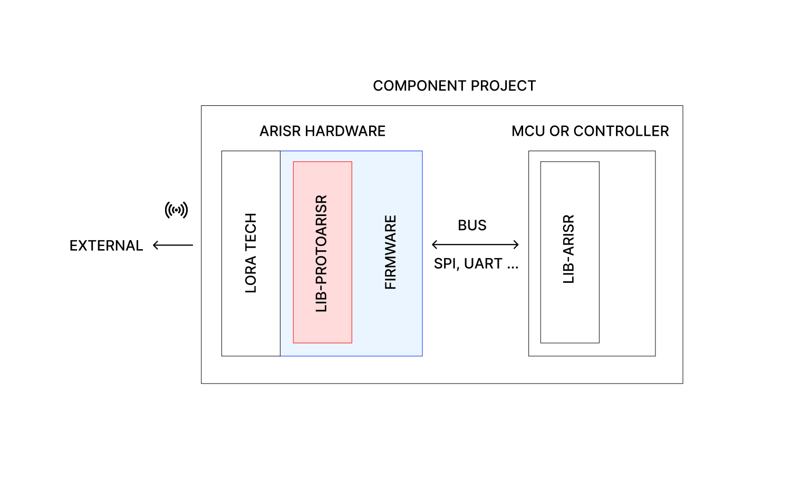

<a name="readme-top"></a>
<br /><br /><br />
<p align="center">
    <a href="https://github.com/aris-radio/lib-protoarisr-c/">
        
    </a>
</p>
<h5 align="center" style="font-family: monospace;">Library of ARISR Radio Protocol</h5>
<p align="center">
    <span><i>"Make it easier"</i></span>
</p>
<br /><br /><br />
<p align="center">
    <span>Manage, parse and build ARIS Radio protocol chunks for your projects</span>
</p>
<!-- <br />
<p align="center" id="badges">
</p>
<br /><br /> -->
<p align="center">
    <a href="#introduction">Introduction</a> -
    <a href="#-quick-start">Quick Start</a> -
    <a href="#-how-to-use">How To Use</a> -
    <a href="#-download">Download</a> -
    <a href="#-examples">Examples</a> -
    <a href="#license">License</a>
</p>
<p align="center">
    <a href="#developer-section">Developer Section</a>
</p>
<br /><br /><br />


## Introduction

This repository contains the complete source code required to compile the ARIS Radio protocol library. It includes a comprehensive testing suite to validate the library’s functionality and performance, ensuring reliable protocol implementation.

<b>Key Features:</b>

  - **Testing & Debugging** - The repository provides a dedicated test suite for verifying protocol behavior and compatibility.
  - **Memory Integrity Checks** - Integrated **Valgrind** configurations allow for thorough memory leak detection, profiling, and validation, enhancing stability and performance.
  - **Docker Integration** - A pre-configured **Docker environment** is included to simplify development, testing, and deployment, reducing dependency issues and ensuring consistency across different systems.

> \[!NOTE]
>
> Please do not confuse this library with `lib-arisr-c`. While this repository focuses on the ARIS Radio protocol serving as a parser for the content received from LoRa and is directly embedded within the firmware of ARISR hardware, `lib-arisr-c` is only the external library communicator.

Whether you’re integrating, testing, or extending the ARIS Radio protocol, this repository provides all the necessary tools for a seamless development experience.

To better understand which component this library belongs to, the following diagram is provided.  

The **red** color highlights the component covered in this repository, while **blue** indicates where this component should be integrated.  

Although the library is designed for a specific purpose, if you understand its functionality, you can adapt and use it in any context or scenario. 

<p align="center">
    
</p>

<br />
<p align="center">
    <span>_____</span>
</p>
<br /><br />

## 🚀 Quick Start

> [!NOTE]
> 
> Pre-built files are not available for macOS.  
> If you want to use the library on macOS, you must either opt for **Manual Compilation** or pre-compile the `.dylib` and `.a` files before use.

Getting started with the library is simple. You have two options:

1. **Pre-built Library (Recommended for testing scenario)**  
   Download the pre-built library file (dynamic or static) and integrate it into your project effortlessly.

2. **Manual Compilation (Recommended for manual integration of the library)**  
   Clone the repository, copy the source and header files into your project, and compile it yourself. If you need detailed instructions on this process, refer to the [firmware-stm32f1xx](https://github.com/aris-radio/firmware-stm32f1xx) for guidance.

Once you have successfully <a href="#download">downloaded</a> the library, you need to configure your environment to use it dynamically or statically.

Regardless of the method you choose, you must copy the header files to your include path. We recommend placing them in: `/usr/local/include/libprotoarisr/`


---

### 🔹 Dynamic Usage

To use the library dynamically, copy the `.so` (Linux) or `.dll` (Windows) file to your standard library path. We recommend placing it in: `/usr/lib/`

Once copied, you can start coding your project.

<br />

#### How to compile?

Like other dynamic libraries, ensure that the library name is included in the linking path.

```bash
# Library located in /usr/lib/libprotoarisr.so
# Additional files: /usr/lib/libprotoarisr.so.1 /usr/lib/libprotoarisr.so.1.x.x
gcc -o my_program main.c -L/usr/lib -lprotoarisr

# Since this is a dynamic lib you will need this library to be kept in your system
```

<br /><br />
---

### 🔹 Static Usage

To use the library in a static manner, you need to link the `.a` (Linux/macOS) or `.lib` (Windows) file during compilation. You can do it by copying it inside your project `lib/` folder and then use it in your code.

<br />

#### How to compile?

Unlike a dynamic library, this one will be copied into the final binary, encapsulating it into a single file.

```bash
gcc -o my_program main.c -L./lib -lprotoarisr -static

# This will generate a unique binary file
```

<br /><br />
---

It is worth noting that not all pre-built files are available for every system. If you need to obtain the pre-built version for an uncommon system and do not want to integrate the source code into your project, continue reading until the **Developers** section, where you will find instructions on how to generate the pre-built files.

<br />
<p align="center">
    <span>_____</span>
</p>
<br /><br />

## 📕 How to use

Below is a comprehensive overview of the functions implemented in the library. This includes a detailed breakdown of their purpose, expected inputs, and outputs, ensuring clarity and efficiency in their application.

```c
// From lib-ars.h

/**
 * @brief Receives and parses raw data into an ARISR_CHUNK structure.
 *
 * This function processes incoming data byte by byte, extracting protocol sections, 
 * allocating necessary memory, and verifying CRC values for both the header and decrypted data.
 *
 * @param buffer [out] Pointer to the ARISR_CHUNK structure where the parsed and decrypted data will be stored.
 * @param data   [in]  Pointer to the raw input data buffer (e.g., received from a network or file).
 * @param key    [in]  AES-128 key used for decrypting the 'aris' section.
 * @param id     [in]  Expected Network ID section to validate against the incoming data.
 * @return kARISR_OK on success, or an error code indicating invalid parameters, CRC mismatches, etc.
 * 
 * @note The caller is responsible for freeing the memory allocated for *buffer using ARISR_proto_chunk_clean.
 */
ARISR_ERR ARISR_proto_parse(ARISR_CHUNK *buffer, const ARISR_UINT8 *data, const ARISR_AES128_KEY key, ARISR_UINT8 *id);

/**
 * @brief Constructs and serializes an ARISR_CHUNK structure into raw data format.
 *
 * This function assembles the raw data byte by byte according to the protocol specifications,
 * dynamically allocates necessary memory, and computes CRC values for both the header and data.
 *
 * @param buffer [out] Pointer to the allocated raw data buffer.
 * @param length [out] Pointer to the size of the raw data buffer.
 * @param data   [in]  Pointer to the ARISR_CHUNK structure containing the data to be serialized.
 * @param key    [in]  AES-128 key used for encrypting the data section.
 * @return kARISR_OK on success, or an error code indicating invalid parameters, CRC mismatches, etc.
 * 
 * @note The caller is responsible for freeing the memory allocated for *buffer.
 */
ARISR_ERR ARISR_proto_build(ARISR_UINT8 **buffer, ARISR_UINT32 *length, ARISR_CHUNK *data, const ARISR_AES128_KEY key);
```

> [!NOTE]
> 
> All buffer parameters are allocated by the function before use, and the user must free them after use. If an error occurs, the buffer is automatically cleaned; otherwise, the user must manually free it.


The usage of these functions is straightforward and designed to streamline data processing within the library. Below is a more detailed explanation of their functionality, expected behavior, and best practices for their implementation:

### `ARISR_proto_parse`  
This function is responsible for interpreting raw incoming data and converting it into an `ARISR_CHUNK` structure for easy access and manipulation. It performs several key operations:  

1. **Byte-by-byte parsing**: The function iterates through the input data, extracting protocol-specific sections and separating relevant fields.  
2. **Memory allocation**: Necessary memory is dynamically allocated for storing parsed data.  
3. **Data decryption**: If encryption is used, the function applies AES-128 decryption on the ‘aris’ section using the provided key.  
4. **CRC validation**: The function checks the integrity of both the header and decrypted data to detect potential corruption or transmission errors.  
5. **Network ID verification**: The received Network ID is compared with the expected ID to ensure data authenticity and prevent processing of invalid chunks.  

#### Example Usage:
```c
ARISR_CHUNK parsed_data;
ARISR_ERR result = ARISR_proto_parse(&parsed_data, raw_data, decryption_key, expected_id);
if (result == kARISR_OK) {
    // Successfully parsed, proceed with processing
} else {
    // Handle error (invalid data, CRC failure, etc.)
}
ARISR_proto_chunk_clean(&parsed_data); // Free allocated memory
```

### `ARISR_proto_build`  
This function prepares an `ARISR_CHUNK` structure for transmission by serializing it into a raw data format according to protocol specifications. Key steps include:

1. **Struct to raw data conversion**: Transforms structured data into its raw binary equivalent, ensuring compatibility with protocol standards.  
2. **Memory allocation**: Allocates memory dynamically for storing the generated raw data buffer.  
3. **Data encryption**: If encryption is enabled, AES-128 encryption is applied to secure the data before transmission.  
4. **CRC calculation**: Generates CRC values for both the header and data section to ensure integrity and reliability.  

#### Example Usage:
```c
ARISR_UINT8 *output_buffer = NULL;
ARISR_UINT32 output_length = 0;

ARISR_ERR result = ARISR_proto_build(&output_buffer, &output_length, &chunk_data, encryption_key);
if (result == kARISR_OK) {
    // Successfully built, send data via network or save to file
} else {
    // Handle error (memory allocation failure, invalid parameters, etc.)
}

free(output_buffer); // Free allocated memory
```

### Error Handling and Best Practices  
- Always check the return value of both functions to detect errors and prevent unexpected behavior.  
- Ensure that allocated memory is properly freed using `ARISR_proto_chunk_clean` for parsed data and `free()` for raw output buffers.  
- Validate inputs before calling these functions to minimize processing errors and avoid unnecessary memory allocations.  
- When handling large data sets, consider optimizing memory management by reusing buffers instead of reallocating them frequently.

By following these guidelines, you can efficiently integrate `ARISR_proto_parse` and `ARISR_proto_build` into your system, ensuring robustness, security, and maintainability.


Here's an improved version of your text with clearer explanations, better grammar, and enhanced readability:

---

### Partial Functions for ARISR Protocol

Certain functions are included for optional use and can be enabled by defining `#define ARISR_PROTO_PARTIAL_FUNCTIONS` in the source code or by passing the `-DARISR_PROTO_PARTIAL_FUNCTIONS` flag during compilation. These functions are disabled by default but are available for users if needed.

#### Function Definitions

```c
/**
 * @brief Receives and parses raw data into an ARISR_CHUNK_RAW structure.
 *
 * This function reads incoming data byte by byte, separating protocol sections,
 * allocating memory as needed, and verifying CRC values for both the header and data.
 *
 * @param buffer Pointer to the ARISR_CHUNK_RAW structure where parsed data will be stored.
 * @param data   Pointer to the raw input data buffer (e.g., received from a network or file).
 * @param key    The AES-128 key used to decrypt the 'aris' section.
 * @param id     The expected Network ID to validate the incoming data.
 * @return kARISR_OK on success, or an error code indicating invalid parameters, CRC mismatch, etc.
 * 
 * @note The caller must free the allocated memory for `buffer` only if the function returns kARISR_OK.
 * @note Use `ARISR_proto_raw_chunk_clean` to release allocated memory.
 * @note If any other error occurs, no memory is allocated.
 */
ARISR_ERR ARISR_proto_recv(ARISR_CHUNK_RAW *buffer, const ARISR_UINT8 *data, const ARISR_AES128_KEY key, ARISR_UINT8 *id);

/**
 * @brief Unpacks and decrypts an ARISR_CHUNK_RAW structure into an ARISR_CHUNK structure.
 *
 * This function processes data received via `ARISR_proto_recv`, decrypting the data section
 * using the provided AES-128 key and making the fields accessible for the user.
 *
 * @param buffer [out] Pointer to the ARISR_CHUNK structure where parsed data will be stored.
 * @param data   [in]  Pointer to the raw data structure (received from `ARISR_proto_recv`).
 * @param key    [in]  The AES-128 key used to decrypt the data section.
 * @return kARISR_OK on success, or an error code indicating invalid parameters, CRC mismatch, etc.
 * 
 * @note The caller must free the allocated memory for `buffer` only if the function returns kARISR_OK.
 * @note Use `ARISR_proto_chunk_clean` to release allocated memory.
 * @note If any other error occurs, no memory is allocated.
 */
ARISR_ERR ARISR_proto_unpack(ARISR_CHUNK *buffer, ARISR_CHUNK_RAW *data, const ARISR_AES128_KEY key);

/**
 * @brief Packs and encrypts an ARISR_CHUNK structure into an ARISR_CHUNK_RAW structure.
 *
 * This function prepares outgoing data in a raw format, encrypting the data section
 * using the provided AES-128 key. CRC values are not calculated in this function
 * but are handled in the send function.
 *
 * @param buffer [out] Pointer to the ARISR_CHUNK_RAW structure where packed data will be stored.
 * @param data   [in]  Pointer to the structured data buffer to be transmitted.
 * @param key    [in]  The AES-128 key used to encrypt the data section.
 * @return kARISR_OK on success.
 * 
 * @note The caller must free the allocated memory for `buffer` only if the function returns kARISR_OK.
 * @note Use `ARISR_proto_raw_chunk_clean` to release allocated memory.
 * @note If any other error occurs, no memory is allocated.
 */
ARISR_ERR ARISR_proto_pack(ARISR_CHUNK_RAW *buffer, ARISR_CHUNK *data, const ARISR_AES128_KEY key);

/**
 * @brief Prepares and sends an ARISR_CHUNK_RAW structure as raw data.
 *
 * This function constructs the raw data byte by byte according to the protocol,
 * allocating memory as needed and computing CRC values for both the header and data.
 *
 * @param buffer [out] Pointer to the raw output data buffer.
 * @param data   [in]  Pointer to the ARISR_CHUNK_RAW structure containing parsed data.
 * @param length [out] Pointer to the size of the raw data buffer.
 * @return kARISR_OK on success, or an error code indicating invalid parameters, CRC mismatch, etc.
 * 
 * @note The caller must free the allocated memory for `buffer` only if the function returns kARISR_OK.
 * @note If any other error occurs, no memory is allocated.
 */
ARISR_ERR ARISR_proto_send(ARISR_UINT8 **buffer, ARISR_CHUNK_RAW *data, ARISR_UINT32 *length);
```

---

### Example Usage

Using these functions is straightforward. Below is a small example, which you can also find in `./test/main.c`:

```c
char *raw;
ARISR_RAW_CHUNK buffer;
ARISR_CHUNK interface;
ARISR_ERR err;

recv(raw); // Example function to receive data

// Step 1: Receive and parse the raw data
if ((err = ARISR_proto_recv(&buffer, raw, NULL, id)) != kARISR_OK) {
    LOG_ERROR("TEST FAILED: Error %d (%s), expected %d", err, ARISR_ERR_NAMES[err], kARISR_OK);
    return err;
}

// Step 2: Unpack and decrypt the parsed data
if ((err = ARISR_proto_unpack(&interface, &buffer, NULL)) != kARISR_OK) {
    LOG_ERROR("TEST FAILED: Unpacking error %d (%s)", err, ARISR_ERR_NAMES[err]);
    return err;
}

// Step 3: Clean up the buffer after use
ARISR_proto_raw_chunk_clean(&buffer);

// Step 4: Process the unpacked data (e.g., print information)
printBuffer(&interface);

// Step 5: Clean up the interface structure
ARISR_proto_chunk_clean(&interface);
```

---

### Example Output

Below is an example of the expected output when the interface processes and prints the received data:

```log
[2025-02-16 00:49:58] [INFO] [ID]          00 11 22 33
[2025-02-16 00:49:58] [INFO] [ARIS]        41 52 49 53
[2025-02-16 00:49:58] [INFO] [CTRL]
[2025-02-16 00:49:58] [INFO]   [VER]          2
[2025-02-16 00:49:58] [INFO]   [DEST]         2
[2025-02-16 00:49:58] [INFO]   [OPT]          0
[2025-02-16 00:49:58] [INFO]   [FROM]         0
[2025-02-16 00:49:58] [INFO]   [SEQ]          1
[2025-02-16 00:49:58] [INFO]   [RET]          0
[2025-02-16 00:49:58] [INFO]   [MD]           1
[2025-02-16 00:49:58] [INFO]   [ID]           110
[2025-02-16 00:49:58] [INFO]   [MH]           1
[2025-02-16 00:49:58] [INFO] [ORIGIN]      00 1A 2B 3C 4D 5E
[2025-02-16 00:49:58] [INFO] [DEST A]      FA 16 3E 2F EC A8
[2025-02-16 00:49:58] [INFO] [DEST B] 
[2025-02-16 00:49:58] [INFO]   [000]          00 1A 2B 3C 4D 5E
[2025-02-16 00:49:58] [INFO]   [001]          00 1B 63 84 45 E6
[2025-02-16 00:49:58] [INFO] [CTRL2]
[2025-02-16 00:49:58] [INFO]   [DL]           41
[2025-02-16 00:49:58] [INFO]   [FEAT]         0
[2025-02-16 00:49:58] [INFO]   [NEG]          0
[2025-02-16 00:49:58] [INFO]   [FREQ]         0
[2025-02-16 00:49:58] [INFO] [CRC H]       D5 F1
[2025-02-16 00:49:58] [INFO] [CRC D]       D0 1F
[2025-02-16 00:49:58] [INFO] [END]         00 11 22 33
[2025-02-16 00:49:58] [INFO] 
[2025-02-16 00:49:58] [INFO] [DATA] 
[2025-02-16 00:49:58] [INFO] 0000: 00 01 02 03 04 05 06 07 08 09 0A 0B  |............|
[2025-02-16 00:49:58] [INFO] 000c: 0C 0D 0E 0F 10 11 12 13 14 15 16 17  |............|
[2025-02-16 00:49:58] [INFO] 0018: 18 19 1A 1B 1C 1D 1E 1F 20 21 22 23  |........ !"#|
[2025-02-16 00:49:58] [INFO] 0024: 24 25 26 27 28                       |$%&'(       |
```

This output shows how the interface processes raw data, extracts relevant fields, and displays them in a structured format.

---

### Summary

- The provided functions allow you to parse, unpack, pack, and send ARISR protocol messages.
- Error handling ensures memory is only allocated when operations succeed.
- A working example is available in `./test/main.c` for reference.


<br />
<p align="center">
    <span>_____</span>
</p>
<br /><br />

## 💾 Download

Downloads are available in the [Releases](https://github.com/aris-radio/lib-protoarisr-c/releases/) section.  
Once you have downloaded and extracted the desired version, you will find the following directory structure:

```
libprotoarisr-1.0.0
│
├── include
│   ├── lib_arisr_aes.h
│   ├── lib_arisr_base.h
│   ├── lib_arisr_comm.h
│   ├── lib_arisr_crypt.h
│   ├── lib_arisr_err.h
│   ├── lib_arisr_interface.h
│   └── lib_arisr.h
│
├── lib
│   ├── ARM_CortexM
│   │   └── libprotoarisr.a
│   │
│   ├── Linux-x86_64
│   │   ├── libprotoarisr.a
│   │   └── libprotoarisr.so
│   │
│   └── Windows-x86_64
│       ├── libprotoarisr.dll
│       └── libprotoarisr.lib
│
└── version
```

Within the `lib` directory, you need to select the appropriate library based on your system and architecture for implementing your project.  

We recommend using Docker environments to simulate the final product compilation.  

If a pre-built version for your system is not available, as mentioned earlier, you will need to manually compile the library or include it directly in your project.


<br />
<p align="center">
    <span>_____</span>
</p>
<br /><br />

## 💡 Examples

To help you get started with the library, we have included a set of examples in the `./test` directory. These examples demonstrate the usage of the library functions and provide a clear understanding of how to integrate them into your projects.

The examples cover various scenarios, such as parsing raw data, building protocol chunks, and handling encryption/decryption operations. By studying these examples, you can gain practical insights into the library’s capabilities and explore different use cases.

To compile and run the examples, follow these steps:

1. Navigate to the `./test` directory.
2. Compile the examples using the provided Makefile. `make run`
3. Run the compiled executable to observe the output.

The examples are designed to be self-explanatory and provide a hands-on experience with the library functions. Feel free to modify the examples or create your own based on the provided templates.

In addition to the examples, here there are some additional resources to help you understand the library better:

### Must Read

When using the library, it is essential to understand the following key concepts:

- **ARISR_CHUNK Structure**: This structure represents the ARISR protocol chunk and contains various fields such as ID, ARIS, CTRL, ORIGIN, DEST, and DATA. Understanding the structure is crucial for parsing, building, and processing protocol messages.

- **Encryption and Decryption**: The library supports AES-128 encryption for securing data transmission. By providing the encryption key, you can encrypt and decrypt the 'aris' section of the protocol chunk.

- **Error Handling**: The library includes error codes to indicate various conditions such as invalid parameters, CRC mismatches, and memory allocation failures. Proper error handling ensures robustness and reliability in your applications.

By familiarizing yourself with these concepts and exploring the examples, you can effectively leverage the library’s features and integrate them into your projects with confidence.

### Additional Resources

For further information and detailed explanations, refer to the following resources:

- **API Documentation**: (Not Yet Available) - A comprehensive guide to the library functions, parameters, and return values.
- **Code Comments**: Detailed comments within the source code provide insights into the implementation details and usage guidelines.
- **Test Suite**: The test suite in the `./test` directory demonstrates the library functions in action and serves as a reference for testing and validation.
- **ARISR Firmware Project**: The ARISR firmware project [firmware-stm32f1xx](https://github.com/aris-radio/firmware-stm32f1xx) showcases the library’s integration within the ARISR hardware and provides real-world examples of protocol communication.

<br />
<p align="center">
    <span>_____</span>
</p>
<br /><br />


## License

This library is distributed under the GNU GENERAL PUBLIC LICENSE License. For more information, refer to the [LICENSE](./LICENSE) file.

<br /><br /><br /><br />
<br /><br />

<h4 align="center" name="developer-section" style="font-family: monospace;">Developer Section</h4>

<p align="center">
    <a href="#introduction">Introduction</a> -
    <a href="#-compilation">Compilation</a> -
    <a href="#-docker">Docker</a> -
    <a href="#-integration">Integration</a> -
    <a href="#-generate-version">Generate Version</a>
</p>

<br /><br /><br />

## Introduction

The developer section provides detailed instructions on how to compile the library, set up a Docker environment, and generate version information. These steps are essential for maintaining and extending the library, ensuring consistency and reliability across different systems. Moreover you can learn how to integrate with source the library into your project.

<br />
<p align="center">
    <span>_____</span>
</p>
<br /><br />

## 🛠 Compilation

To compile the library, follow these steps:

1. Clone the repository to your local machine.
2. Navigate to the root directory of the repository.
3. Run the following commands:

```bash
make clean
make
```

This will compile the library and generate the necessary output files. The compiled library will be available in the `./bin` directory, ready for integration into your projects.

Additionally, you can run the test suite to verify the library’s functionality:

```bash
cd test/

make clean && make run

# Or running the test script
cd ./script
./TEST.sh
```

This will compile the test suite and execute the tests, providing insights into the library’s performance and behavior. 

<br />
<p align="center">
    <span>_____</span>
</p>
<br /><br />

## 🐳 Docker

To prevent dependency issues and ensure consistent development environments, we provide a Docker configuration for compiling and testing the library. You must have Docker installed on your system to use this feature.

There are some pre-configured Dockerfiles available in the `./docker` directory. You can use these Dockerfiles to set up a development environment quickly and efficiently.

Inside the folder `./scripts`, you will find a script named `BUILD.sh`. This script simplifies the Docker setup process by automatically building the Docker image and running the container and compiling the library. Also you will find a script named `TEST.sh` to run the test suite with Valgrind.

The project is shared inside the container at path /app with volume, so you can modify the source code and compile it inside the container without exiting and running again. Also you have the access to the binaries compiled inside the container from the host machine.

<br />
<p align="center">
    <span>_____</span>
</p>
<br /><br />

## 📦 Integration

To integrate the library into your project, follow these steps:

1. Copy the necessary header files from the `./include` directory to your project’s include path.
2. Copy the source files from the `./src` directory to your project’s source directory.
3. Include the required header files in your project files.


A example of how to include the library in your project is shown below:

```c
│
├── include
│   └── main.h
│
├── src
│   └── main.c
│
└── lib
    ├── libprotoarisr
    │   ├── include
    │   │   ├── lib_arisr_aes.h
    │   │   ├── lib_arisr_base.h
    │   │   ├── lib_arisr_comm.h
    │   │   ├── lib_arisr_crypt.h
    │   │   ├── lib_arisr_err.h
    │   │   ├── lib_arisr_interface.h
    │   │   └── lib_arisr.h
    │   │
    │   └── source
    │       ├── lib_arisr_aes.c
    │       ├── lib_arisr_crypt.c
    │       └── lib_arisr.c
    │
    └── Other lib
        ├── ...
        └── ...
```

In your `main.c` file, you can include the library header files as follows:

```c
#include "lib_arisr.h"

int main() {
    // Your code here
    return 0;
}
```

And the makefile should be like this:

```makefile
CC = gcc
CFLAGS = -Wall -Wextra -Werror -I./lib/libprotoarisr/include

BUILD_DIR = ./build
SRC_DIR = ./src
LIB_DIR = ./lib/libprotoarisr/source

SRC_FILES = $(wildcard $(SRC_DIR)/*.c)
LIB_FILES = $(wildcard $(LIB_DIR)/*.c)

OBJ_FILES = $(patsubst $(SRC_DIR)/%.c,$(BUILD_DIR)/%.o,$(SRC_FILES)) $(patsubst $(LIB_DIR)/%.c,$(BUILD_DIR)/%.o,$(LIB_FILES))

main: $(OBJ_FILES)
    $(CC) $(CFLAGS) -o $@ $^

$(BUILD_DIR)/%.o: $(SRC_DIR)/%.c
    $(CC) $(CFLAGS) -c -o $@ $<

$(BUILD_DIR)/%.o: $(LIB_DIR)/%.c
    $(CC) $(CFLAGS) -c -o $@ $<

clean:
    rm -f $(BUILD_DIR)/*.o main
```

This setup allows you to include the library in your project and compile it seamlessly. You can modify the makefile and project structure as needed to suit your requirements.


<br />
<p align="center">
    <span>_____</span>
</p>
<br /><br />

## 📝 Generate Version

To generate version information for the library, you must first ensure that the library has been compiled with the `.version` file containing the desired version number. The version number should follow the semantic versioning format (e.g., `1.0.0`).

Then you can run the following command to generate the version information:

```bash
make generate
```

This will generate a folder called `version` containing all the files ready to be shared. Also will generate some hash files to ensure the integrity of the files.


<br /><br /><br /><br />

<p align="center">
    <a href="#readme-top">Back to top</a>
</p>
